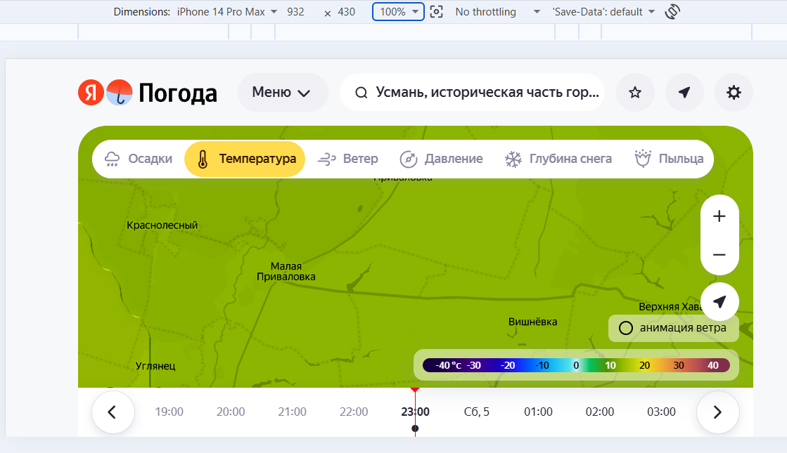

# Переключатель "анимация ветра" на карте температуры расположен справа


## Description
Переключатель анимации ветра на карте температуры расположен справа. Но должен отображаться слева.

В документации карты температуры сказано следующее:
```markdown
Направление движения ветра — в левом нижнем углу включите опцию Анимация ветра. Подробнее об опции см. раздел Карта ветра.
```

В требовании REQ-map-008 та же информация 

```markdown
Влевом нижнем углу можно включить или отключить опцию Анимация ветра.
```

однако на самой карте переключатель отображается внизу справа.
Ожидается слева.

Note: здесь баг на стороне frontend разработчиков

## STR

1. Открыть карту осадков
2. перейти на карту температуры
Ожидаемый результа:
переключатель "анимация ветра" на карте температуры расположен слева внизу

Фактический результат:
переключатель "анимация ветра" на карте температуры расположен справа внизу

## Attachments
Скриншот
