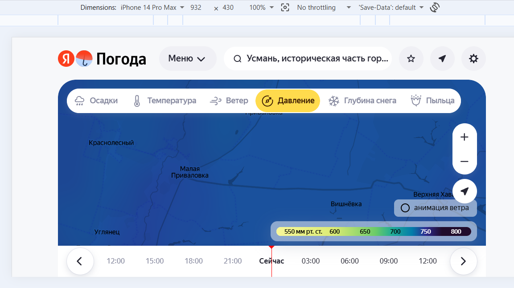

# Цвет шкалы давления на погодной карте "Карта давления" не соответствует ожидаемому


## Description
Ожидается что на карте давления на шкале будет красным цветом обозначено высокое давление и синим - низкое
Однако сейчас цвета на шкале другие.

В документации карты давления сказано следующее:
```markdown
Карта давления показывает текущее атмосферное давление в мире, а также данные на предыдущие и следующие 36 часов. Красным цветом обозначаются регионы с самым высоким давлением, синим — с самым низким.
```

В требовании REQ-map-010 та же информация 

```markdown
Места с низким давлением обозначены синим цветом, места с высоким давлением - красным
```

однако на самой карте на шкале давления используются другие цвета.

Note: здесь баг на стороне frontend разработчиков

## STR

1. Открыть карту осадков
2. перейти на карту давления
Ожидаемый результа:
на карте давления на шкале давления красным цветом обозначено высокое давление и синим - низкое

Фактический результат:
на карте давления на шкале давления черным цветом обозначено высокое давление и желтым - низкое

## Attachments
Скриншот
