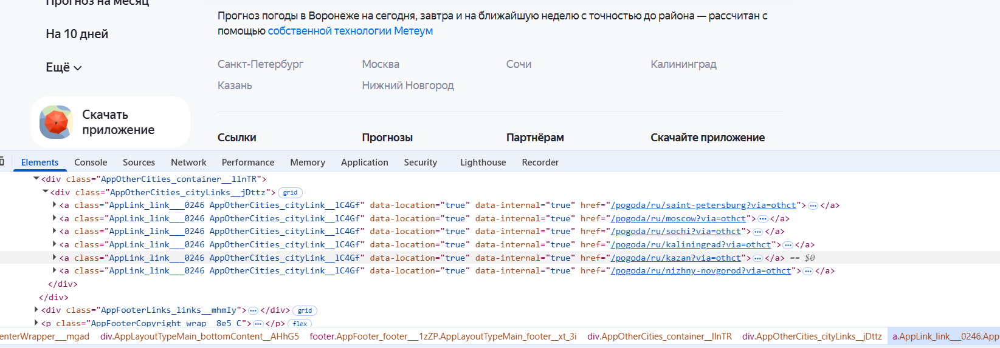

# Отсутствие кнопок "Погода в России" и "В мире" в блоке "погода в других городах"

## Description
В блоке "Погода в других городах" отсутствуют кнопки "Погода в России" и "В мире".
 
В требовании REQ-search-004 указано:
- В блоке отображаются кнопки "Погода в России" и "В мире"
- При нажатии на кнопку "Погода в России" можно выбрать регион, а затем город из списка
- При нажатии на кнопку "В мире" можно выбрать нужную страну, а затем город из списка

В документации сервиса эта информация подтверждается:
[ссылка на документацию](https://yandex.ru/support/weather/ru/faqservice#other-city)
Узнать прогноз погоды - Выбор местоположения - раздел "Прогноз для моего города и района"

```markdown
В полной версии
Под прогнозом на 10 дней выберите место из блока Погода в других городах и посмотрите данные для него. Если города нет в списке, нажмите кнопку Погода в России, выберите нужный регион, а затем город из списка.

Чтобы выбрать город в другой стране, в блоке Погода в других городах нажмите кнопку В мире, выберите нужную страну, а затем город из списка.
```

Note: Здесь нужно проверить сервис который формирует набор информации для блока "Погода в других городах". При отсутствии в формируемом списке значений соответствующим "Погода в России" и "В мире" - баг заводится на backend разработчиков. При наличии значений "Погода в России" и "В мире" - баг заводится на frontend разработчиков.

## STR

1. Открыть страницу https://yandex.ru/pogoda/
2. Прокрутить страницу до блока "погода в других городах"

Ожидаемый результат:
1. В блоке отображаются города
2. В блоке отображаются кнопки "Погода в России" и "В мире"

Фактический результат:
1. В блоке отображаются города
2. В блоке отсутствуют кнопки "Погода в России" и "В мире"

## Attachments

Пример отображения:
