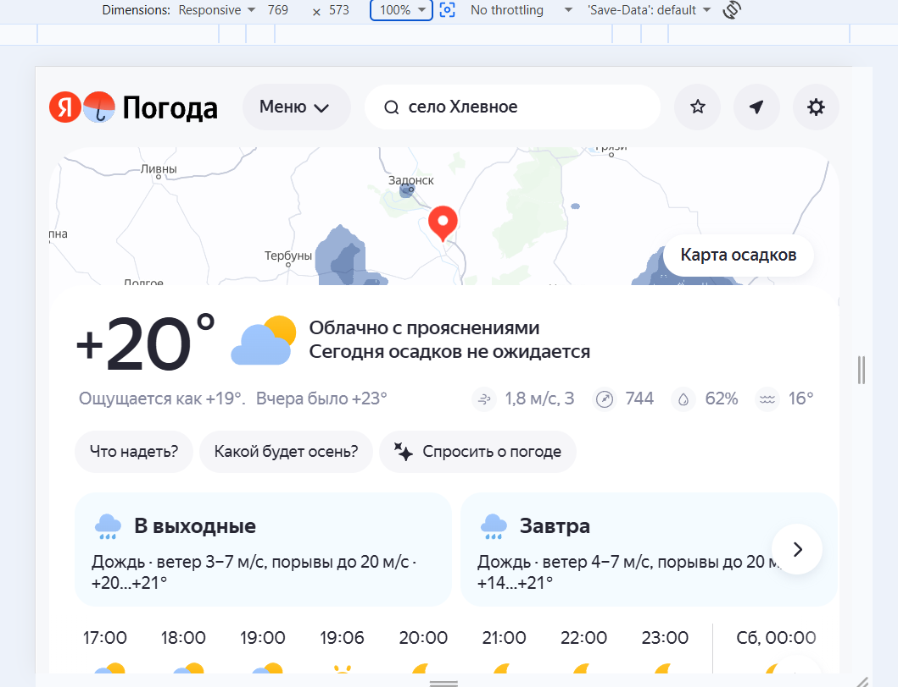
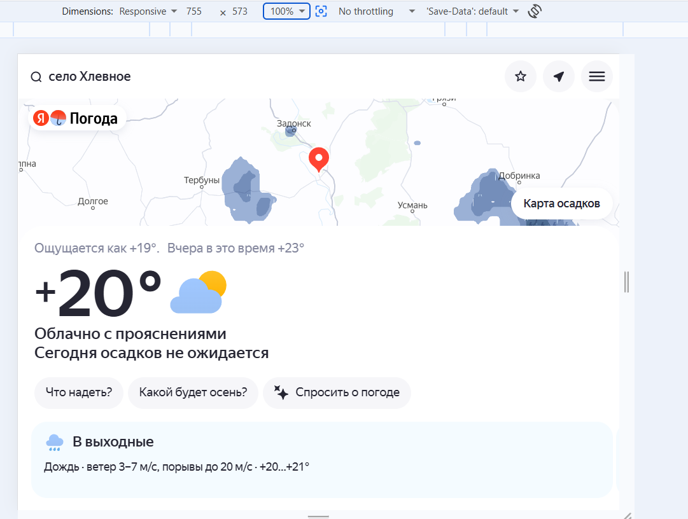

# Покрытие тест кейсами модуля main

## Description

Для требования REQ-main-001 есть неточность.
файл [требование REQ-main-001](../requirements/REQ-main-001.md)
В источнике для требования [ссылка на страницу](https://yandex.ru/support/weather/ru/main-page)
указано:

> Фактический прогноз показывает текущие погодные условия в выбранной локации

для него не указан конкретный набор показателей . В частности для разрешения экрана с шириной от 0 до 767 точек для фактического прогноза не отображаются данные о давлении, о ветре и о влажности воздуха.

NOTE: здесь указан assignee как QA - но чаще всего такие задачи назначают или на PM (ответственного за документирование проекта) или на команду аналитики (отвечающую за требования) 

## STR

Ожидаемый результ:
требование покрывает функционал сайта и не противоречит документации.
Отображение фактического прогноза соответствует ожидаемому

Фактический результат:
требование не соответствует документации что приводит к некорректным результатам тестов для разрешения экрана с шириной от 0 до 767 точек. Для фактического прогноза отображается другой набор данных

## Attachments
- отображение данных для фактического прогноза для разрешения более 768 точек 

- отображение данных для фактического прогноза для разрешения менее 767 точек
