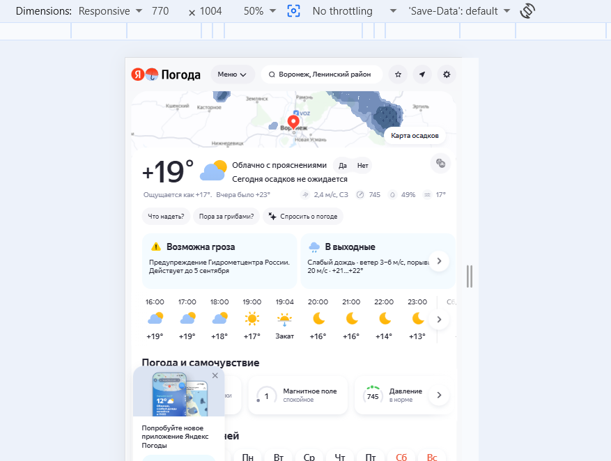
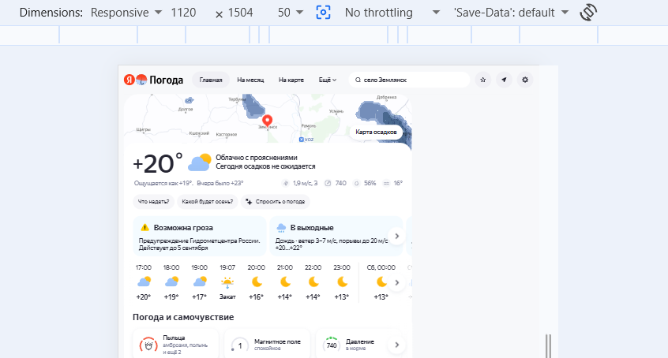

# Покрытие тест кейсами модуля menu

## Description

Текущее покрытие модуля menu для тест кейсов не учитывают нескольких адаптивных вариантов расположения меню для сервиса Яндекс погода.
https://yandex.ru/pogoda/ . Требуется добавить варианты тест кейсов которые будут покрывать недостающие случаи.

Меню отображается в четырех разных вариантах, в зависимости от значения ширины отображаемого экрана в точках.
- от 1374 и более - случай покрыт тест кейсом TC-menu-013
- от 1116 до 1373 - случай не покрыт тест кейсом
- от 768 до 1115 - случай не покрыт тест кейсом
- от 0 до 767 - случай покрыт тест кейсом TC-menu-012 

## STR

Ожидаемый результа:
для любого разрешения экрана есть соответствующий тест кейс применимый для этого случая

Фактический результат:
для разрешений экрана соответствующих экранам с шириной от 768 до 1373 точек нет тест кейсов.
- от 1116 до 1373 - случай не покрыт тест кейсом
- от 768 до 1115 - случай не покрыт тест кейсом

## Attachments

